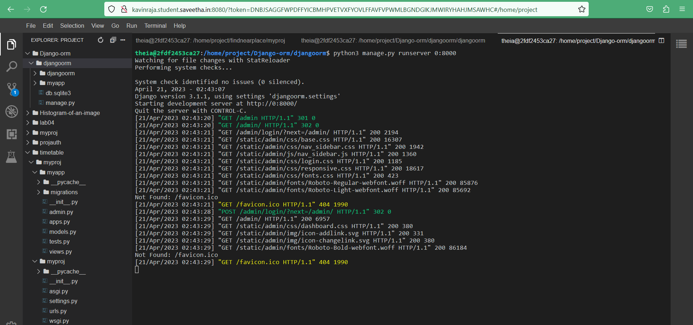
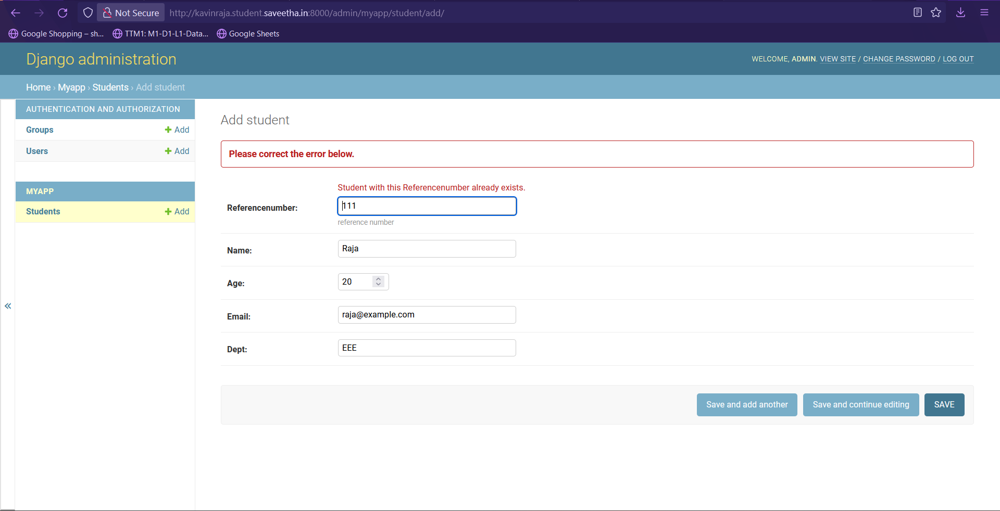

# Django ORM Web Application

## AIM
To develop a Django application to store and retrieve data from a database using Object Relational Mapping(ORM).

## Entity Relationship Diagram


## DESIGN STEPS

### STEP 1:
Create a django application using django-admin startapp <appname> in command line.
Head to the application directory created inside the project directory. Open the models.py file.
In models.py create two classes one defining the attributes and the other one defining attribute value types.

### STEP 2:
 In the same directory, Head to admins.py and import the two classes from models.py that you have created earlier.
 Now register your created models in admins.py file and save both the files

### STEP 3:

 Start the Django server and head over to admin page.
Using the admin interface, you can add or delete data in the dat

## PROGRAM

## File:Models.py
``` python
from django.db import models
from django.contrib import admin

class Student(models.Model):
    referencenumber=models.CharField(primary_key=True,max_length=20,help_text="reference number")
    name=models.CharField(max_length=100)
    age=models.IntegerField()
    email=models.EmailField()
    dept=models.CharField(max_length=5)


class StudentAdmin(admin.ModelAdmin):
    list_display=('referencenumber','name','age','email','dept')
```
## File:Admin.py
```python
from django.contrib import admin
from .models import Student,StudentAdmin
admin.site.register(Student,StudentAdmin)
```

## CLIENT OUTPUT

## SERVER OUTPUT

## Verifying Primary-key



## RESULT
A Django application has been created that can be used to store and retrieve data from the database using Object Relational Mapping(ORM).